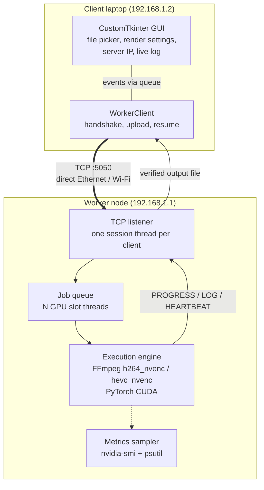

# Distributed Task Offloading & Remote GPU Rendering System

**CSC-334 Parallel and Distributed Computing, Main Task**

| | |
|---|---|
| **Name** | Gulfam Ali |
| **Registration No.** | FA23-BSE-030 |
| **Course** | CSC-334 Parallel and Distributed Computing |

A laptop with a weak CPU hands its heavy work to a GPU machine on the same
network. You pick a video in the desktop client, choose resolution, bitrate
and preset, and press Start. The file goes to the worker over a direct LAN
link, the worker encodes it with NVIDIA NVENC, and progress streams back live:
percentage, FPS, speed and ETA. The rendered file comes back checksum-verified.
The worker can also run a CUDA matrix-multiply job through PyTorch for
general GPU compute.

Everything runs over a custom TCP protocol with an authenticated handshake,
latency check, SHA-256 verified transfers, heartbeats, and automatic
reconnect-and-resume if the connection drops mid-job.

---

## Contents

- [Problem statement](#problem-statement)
- [Architecture](#architecture)
- [How each task is covered](#how-each-task-is-covered)
- [Project structure](#project-structure)
- [Requirements](#requirements)
- [1. Network setup](#1-network-setup)
- [2. Worker setup and starting the daemon](#2-worker-setup-and-starting-the-daemon)
- [3. Client setup and launching the GUI](#3-client-setup-and-launching-the-gui)
- [Progress streaming and fault tolerance](#progress-streaming-and-fault-tolerance)
- [Performance benchmark](#performance-benchmark)
- [Screenshots and demo](#screenshots-and-demo)
- [Submission checklist](#submission-checklist)
- [Tests](#tests)
- [Troubleshooting](#troubleshooting)

---

## Problem statement

The scenario from the assignment: a developer works on a laptop with only an
integrated GPU or a low-end card with about 500 MB of VRAM. Heavy jobs such as
high-resolution transcoding, rendering or deep-learning work either crawl,
throttle the laptop, or fail with out-of-memory errors. Buying new hardware is
not an option, but there is a desktop with a dedicated NVIDIA GPU (4 GB+) on
the same network.

The fix is **task offloading**. The laptop packages the job (input file and
settings), sends it over a fast local link (a direct CAT6 cable or Wi-Fi) to
the desktop, which runs it on dedicated hardware engines (NVENC for video,
CUDA for tensor maths) and streams progress and the result back. The laptop
stays responsive and only deals with the interface and the file transfer.

Offloading only helps if what you save in compute time is more than what you
spend moving data. Measuring that trade-off is the point of the benchmark
section.

| Node | Hardware this was designed for | Role |
|---|---|---|
| Client laptop | integrated / low-end GPU (~500 MB VRAM), CPU-only encoding | GUI, job configuration, upload/download |
| Worker node | dedicated NVIDIA GPU, 4 GB+ VRAM, NVENC | headless daemon, task queue, GPU execution |

---

## Architecture



Request path, step by step:

1. **Handshake.** `HELLO → CHALLENGE → AUTH (HMAC) → WELCOME`. The worker reports its GPU, its working encoders and whether it is accepting jobs. The client then sends a few `PING`s to measure round-trip latency and jitter.
2. **Submit.** The client sends the job settings plus the file's size and SHA-256. The worker checks the settings against fixed whitelists before accepting a single byte.
3. **Upload.** Raw bytes stream over the socket. The worker hashes them as they arrive and only accepts the file if the digest matches.
4. **Queue and render.** The job waits for a free GPU slot, then FFmpeg runs with NVENC. Its `-progress` output is parsed into percentage/FPS/ETA and pushed to the client about four times a second.
5. **Return.** The client fetches the output, verifies its SHA-256 and confirms. The worker then deletes the job files.

The full message sequence is in [docs/PROTOCOL.md](docs/PROTOCOL.md).

---

## How each task is covered

| Task | Marks | Where | What was done |
|---|---|---|---|
| 1. Networking & handshake | 20 | `common/protocol.py`, `client/connection.py`, [docs/NETWORK_SETUP.md](docs/NETWORK_SETUP.md) | Static IP guide (Windows/Linux, cable and Wi-Fi), length-prefixed JSON framing, HMAC challenge-response auth, protocol version check, ping latency/jitter test, availability check (`accepting`, encoder present, queue not full) before any job is submitted, specific error messages for refused / timed out / unreachable |
| 2. Remote GPU execution daemon | 25 | `server/`, `common/ffmpeg.py` | Configuration parsing and validation against whitelists (codec, resolution, preset, bitrate range, container, matrix size); background worker with a thread per client and a fixed pool of GPU slot threads, NVENC encoding (`h264_nvenc`, `hevc_nvenc`) with CUDA decode, NVENC verified by a test encode at startup, CUDA matmul job through PyTorch, input validation (no client text reaches the FFmpeg command line), token auth, upload size limit, log file rotation, graceful shutdown on SIGINT/SIGTERM, systemd unit + Windows launcher |
| 3. Client GUI | 25 | `client/gui.py` | CustomTkinter dark UI: file picker with media info, output folder, codec / resolution / bitrate / preset, server IP + port + token, test connection, live progress bar and stat tiles, worker status panel, colour-coded log terminal with save/clear, cancel button, settings remembered between runs |
| 4. Progress & robustness | 15 | `common/protocol.py`, `server/jobs.py`, `client/connection.py` | Async PROGRESS / LOG / HEARTBEAT streaming, socket timeouts + TCP keep-alive, SHA-256 on every transfer in both directions, `.part` files so incomplete transfers are never mistaken for complete ones, automatic retry of corrupted uploads/downloads, jobs survive client disconnects and the client reconnects and re-attaches |
| 5. Benchmarking & report | 15 | `benchmark/` | Automated local-vs-remote runs over several resolutions and durations, phase-by-phase timing, speedup (end-to-end and GPU-only), network overhead, link throughput, CPU/GPU/NVENC/VRAM/power utilisation, generated report with tables and charts |

---

## Project structure

```
Remote GPU Rendering System/
├── client/
│   ├── gui.py              desktop app (CustomTkinter)
│   ├── connection.py       WorkerClient: handshake, upload, progress, resume, download
│   ├── local_render.py     same job on the client CPU (benchmark baseline)
│   ├── cli.py              command-line client
│   └── __main__.py         `python -m client` starts the GUI
├── server/
│   ├── worker.py           daemon: listener, sessions, auth, message handlers
│   ├── jobs.py             job queue, GPU slots, heartbeats, cleanup
│   ├── engine.py           NVENC transcode + CUDA matmul execution
│   ├── hardware.py         GPU detection and utilisation sampling
│   ├── render-worker.service   systemd unit
│   └── __main__.py         `python -m server` starts the worker
├── common/
│   ├── protocol.py         framing, message types, verified file transfer
│   └── ffmpeg.py           command builder, settings whitelist, progress parser
├── benchmark/
│   ├── run_benchmark.py    local vs remote benchmark + report generator
│   ├── README.md           methodology and formulas
│   └── results/            generated REPORT.md, CSV, JSON, charts
├── docs/
│   ├── NETWORK_SETUP.md    static IP, cable / Wi-Fi, firewall
│   ├── PROTOCOL.md         wire protocol and failure handling
│   └── screenshots/
├── tests/                  unit + end-to-end tests
├── requirements-client.txt
├── requirements-server.txt
├── start_worker.bat / start_worker.sh / start_client.bat
└── README.md
```

---

## Requirements

**Worker (GPU machine)**

- NVIDIA GPU with NVENC and at least 4 GB VRAM (GeForce GTX 10-series or newer, any RTX card), recent driver
- FFmpeg built with NVENC on `PATH`
  - Windows: the "full" build from [gyan.dev](https://www.gyan.dev/ffmpeg/builds/) includes it
  - Linux: most distro packages include it; check with `ffmpeg -hide_banner -encoders | grep nvenc`
- Python 3.9+
- Optional: PyTorch with CUDA, for the compute job

**Client (laptop)**

- Python 3.9+ with Tk (included with the python.org installer on Windows)
- FFmpeg on `PATH`, only needed for the local baseline in the benchmark

---

## 1. Network setup

Connect the two machines with an Ethernet cable (or put them on one Wi-Fi
subnet) and give them static addresses:

| Machine | IP | Mask |
|---|---|---|
| Worker | `192.168.1.1` | `255.255.255.0` |
| Client | `192.168.1.2` | `255.255.255.0` |

Allow TCP port 5050 through the worker's firewall:

```powershell
New-NetFirewallRule -DisplayName "Remote Render Worker" -Direction Inbound -Protocol TCP -LocalPort 5050 -Action Allow -Profile Any
```

Check with `ping 192.168.1.1` from the client.

Full guide with Linux commands, the Wi-Fi hotspot option and a troubleshooting
table: **[docs/NETWORK_SETUP.md](docs/NETWORK_SETUP.md)**

---

## 2. Worker setup and starting the daemon

```bash
cd "Main Task/Remote GPU Rendering System"
python -m venv .venv
.venv\Scripts\activate            # Linux: source .venv/bin/activate
pip install -r requirements-server.txt
```

For the CUDA compute job, install PyTorch with CUDA as well
([pytorch.org](https://pytorch.org/get-started/locally/) gives the exact
command for your setup).

Check that the GPU and NVENC are visible:

```bash
python -m server.hardware
ffmpeg -hide_banner -encoders | findstr nvenc      # Linux: grep nvenc
```

**Start the worker** (the token is a shared password; use the same one in the client):

```bash
python -m server --token my-secret-token
```

The startup log shows which encoders passed the NVENC test. Example output (GPU name and driver will match your machine):

```
2026-10-04 14:02:11 INFO    engine encoders: {'h264': 'h264_nvenc', 'hevc': 'hevc_nvenc'}
2026-10-04 14:02:12 INFO    worker worker 'GPU-DESKTOP' listening on 0.0.0.0:5050
2026-10-04 14:02:12 INFO    worker GPU: NVIDIA GeForce RTX 3060 (driver 560.94, 12288 MB)
```

Useful options (`python -m server --help` lists all of them):

| Option | Default | Purpose |
|---|---|---|
| `--port` | 5050 | listening port |
| `--token` / `RENDER_TOKEN` env | required | shared access token |
| `--slots` | 1 | jobs encoding on the GPU at the same time |
| `--max-queue` | 16 | jobs allowed to wait |
| `--max-upload-mb` | 4096 | largest accepted input |
| `--retention` | 1800 | seconds a finished output waits to be collected |
| `--workdir` | `~/.render_worker` | job files and `worker.log` |
| `--no-hw-decode` | off | decode on CPU, encode on GPU |
| `--allow-cpu-fallback` | off | use libx264 when there is no NVIDIA GPU (testing only) |

### Running it as a background service

**Windows:** `start_worker.bat` runs it in a console. To have it start with
Windows and keep running in the background, create a Task Scheduler task:

```powershell
$a = New-ScheduledTaskAction -Execute "pythonw.exe" -Argument "-m server --token my-secret-token" `
     -WorkingDirectory "C:\path\to\Remote GPU Rendering System"
$t = New-ScheduledTaskTrigger -AtLogOn
Register-ScheduledTask -TaskName "RemoteRenderWorker" -Action $a -Trigger $t
```

`pythonw` has no console window; the log goes to `%USERPROFILE%\.render_worker\worker.log`.

**Linux (systemd):** see the comments in `server/render-worker.service`:

```bash
sudo cp server/render-worker.service /etc/systemd/system/
sudo systemctl edit render-worker        # set User, WorkingDirectory, RENDER_TOKEN
sudo systemctl enable --now render-worker
journalctl -u render-worker -f
```

---

## 3. Client setup and launching the GUI

```bash
cd "Main Task/Remote GPU Rendering System"
python -m venv .venv
.venv\Scripts\activate
pip install -r requirements-client.txt
python -m client                  # or double-click start_client.bat
```

Using it:

1. Enter the worker IP (`192.168.1.1`), port and token, and press **Test connection**. The status panel shows the GPU, the encoders, queue state and measured latency. The pill in the header turns green when the worker has working NVENC.
2. Under **Job**, browse for an input video. Its resolution, codec, duration and size appear under the path.
3. Pick codec, output resolution, bitrate and NVENC preset (p1 fastest … p7 best quality). The bitrate is filled in automatically when you change resolution.
4. Press **Start render**. The progress card goes through *Uploading → Waiting in queue → Rendering on GPU → Downloading result → Finished*, with live FPS, speed, ETA and transfer rate. Worker-side FFmpeg messages appear in the log in blue.
5. When it finishes, a summary shows time per phase, network overhead and GPU/NVENC utilisation. **Open output folder** takes you to the file.

Switch the job type to **CUDA compute** to run the matrix-multiply job
instead. Progress then shows live GFLOP/s.

### Command-line client

Handy for quick checks and scripting:

```bash
python -m client.cli --server 192.168.1.1 --token my-secret-token ping
python -m client.cli --server 192.168.1.1 --token my-secret-token render input.mp4 --resolution 1080p --bitrate 8000 --preset p4
python -m client.cli --server 192.168.1.1 --token my-secret-token compute --size 4096 --iterations 100
```

---

## Progress streaming and fault tolerance

- **Live progress.** FFmpeg runs with `-progress pipe:1`. The worker turns `out_time_us` into a percentage of the input duration (from `ffprobe`) and sends `PROGRESS` frames about four times a second, plus FFmpeg warnings as `LOG` frames. Sends from the job thread and the session thread share one lock, so frames never interleave on the socket.
- **Heartbeats and timeouts.** While a job is queued or running the worker sends a `HEARTBEAT` every 2 s. The client treats 15 s of silence as a dead link. All socket reads have timeouts, and TCP keep-alive is on.
- **Integrity.** Every transfer, in both directions, is announced with its size and SHA-256 and checked on arrival. Data is written to `*.part` and only renamed after the hash matches. A mismatch triggers an automatic re-send (up to 3 tries).
- **Disconnects.** If the connection drops during upload, the worker throws away the partial file and the client uploads again. If it drops during rendering, the job keeps running on the worker. The client reconnects with back-off (1 s, 2 s, 4 s), sends `ATTACH <job_id>`, and continues from the current progress. If it drops during download, the client fetches again.
- **Cancel.** The Cancel button sends `CANCEL`; the worker terminates FFmpeg and confirms.

All of these paths are covered by `tests/test_end_to_end.py`: the tests kill
the socket mid-render, corrupt an upload, use a wrong token and cancel a job,
and check the outcome each time.

---

## Performance benchmark

```bash
python -m benchmark.run_benchmark --server 192.168.1.1 --token my-secret-token --repeats 3
```

The script runs every resolution/duration combination on the laptop's CPU and
then through the worker. It times each phase (hash, upload, queue, render,
download), samples CPU/GPU/NVENC utilisation, and writes:

- `benchmark/results/REPORT.md`: environment, results table, utilisation table, charts and summary
- `benchmark/results/benchmark_<date>.csv` / `.json`: raw numbers
- `benchmark/results/time_breakdown.png`, `speedup.png`

Methodology, formulas (speedup, GPU-only speedup, overhead, throughput) and
fair-testing notes: **[benchmark/README.md](benchmark/README.md)**.
Results: **[benchmark/results/REPORT.md](benchmark/results/REPORT.md)**.

---

## Screenshots and demo

Captured on the test setup described in the benchmark report. Files are in
[`docs/screenshots/`](docs/screenshots/).

| What it shows | File |
|---|---|
| Worker console at startup (GPU + NVENC detected) | `worker_start.png` |
| `ping` across the direct link and the client's connection test | `network_check.png` |
| GUI connected to the worker (status panel, latency) | `gui_connected.png` |
| Render in progress, live progress + log | `gui_rendering.png` |
| Finished job summary | `gui_done.png` |
| `nvidia-smi` showing NVENC load during a render | `nvidia_smi.png` |
| Demo recording: full job from file pick to output, including progress streaming | `demo.gif` |
| Disconnect test: cable pulled mid-render, client reconnects and finishes | `resume_demo.gif` |

---

## Submission checklist

How the repository maps to section 5 of the assignment:

| Requirement | Where |
|---|---|
| Complete source code, public repository | this folder (repository is public) |
| Separate `client/` and `server/` directories | [`client/`](client/), [`server/`](server/) (shared protocol code in [`common/`](common/)) |
| Step-by-step setup for client and server | [Worker setup](#2-worker-setup-and-starting-the-daemon), [Client setup](#3-client-setup-and-launching-the-gui) |
| Network configuration guide (static IP, Ethernet/Wi-Fi) | [docs/NETWORK_SETUP.md](docs/NETWORK_SETUP.md) |
| How to start the daemon and launch the GUI | sections 2 and 3 above, `start_worker.bat`, `start_client.bat` |
| Screenshots and GIFs of live progress and output | [Screenshots and demo](#screenshots-and-demo) |
| Formal benchmark and analysis report | [benchmark/results/REPORT.md](benchmark/results/REPORT.md), method in [benchmark/README.md](benchmark/README.md) |

---

## Tests

```bash
pip install -r requirements-client.txt -r requirements-server.txt
python -m unittest discover -s tests -t . -v
```

The end-to-end tests start a real worker on localhost with
`--allow-cpu-fallback`, so they also run on a machine without an NVIDIA GPU
(FFmpeg is still required).

---

## Troubleshooting

| Problem | Fix |
|---|---|
| Client: *refused the connection* | worker not running or on a different port |
| Client: *no answer within 5 s* | firewall on the worker is blocking TCP 5050, or wrong IP |
| Client: *worker rejected the access token* | token differs between worker and client |
| Worker log: `encoders: none` | FFmpeg has no NVENC, or the NVIDIA driver is too old for that FFmpeg build. Update the driver, or start with `--allow-cpu-fallback` to test the pipeline |
| Status panel says *CPU fallback* | as above: NVENC failed the startup test encode |
| CUDA compute job rejected | PyTorch not installed or installed without CUDA (`python -c "import torch; print(torch.cuda.is_available())"`) |
| `No module named tkinter` (Linux) | `sudo apt install python3-tk` |
| Upload very slow | you are on Wi-Fi or a 100 Mbit link; check the adapter shows 1.0 Gbps |
